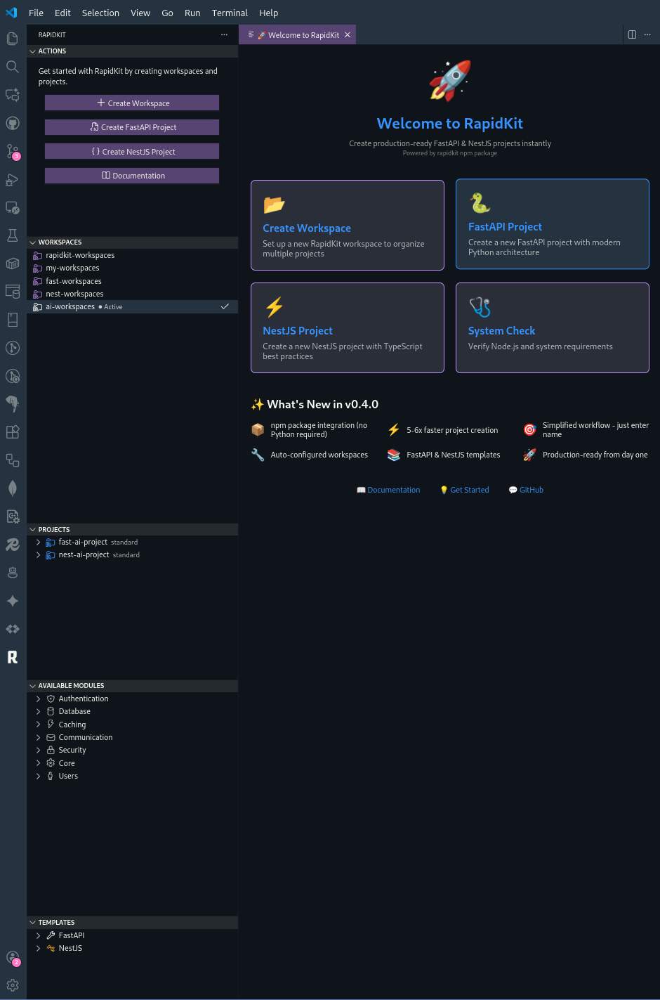

# RapidKit for VS Code

<div align="center">


**Create production-ready FastAPI & NestJS projects in seconds!**

[](https://marketplace.visualstudio.com/items?itemName=rapidkit.rapidkit-vscode)
[](https://marketplace.visualstudio.com/items?itemName=rapidkit.rapidkit-vscode)
[](https://www.npmjs.com/package/rapidkit)

[Install Extension](https://marketplace.visualstudio.com/items?itemName=rapidkit.rapidkit-vscode) · [Documentation](https://getrapidkit.com) · [Report Bug](https://github.com/getrapidkit/rapidkit-vscode/issues)

</div>

---

## 📸 Screenshot



---

## ⚡ Quick Start

```
1. Ctrl+Shift+P → "RapidKit: Create Project"
2. Choose: FastAPI or NestJS
3. Enter project name
4. Done! 🎉
```

Your project is ready with:
- ✅ Full project structure
- ✅ Dependencies configured
- ✅ Dev server ready (`rapidkit dev`)
- ✅ API docs at `/docs`

---

## 🎯 What is RapidKit?

RapidKit generates **production-ready backend projects** with best practices built-in:

| Framework | Language | Features |
|-----------|----------|----------|
| **FastAPI** | Python | Async, auto-docs, type hints, Poetry |
| **NestJS** | TypeScript | Modular, decorators, DI, npm/yarn/pnpm |

---

## 📂 Project Structure

### FastAPI Project
```
my-api/
├── rapidkit              # CLI script
├── .rapidkit/            # RapidKit config
│   ├── cli.py            # CLI commands
│   ├── project.json      # Project metadata
│   └── activate          # Environment activation
├── src/
│   ├── main.py           # FastAPI app entry
│   ├── routing/          # API routes
│   │   └── health.py     # Health check endpoint
│   └── modules/          # Feature modules
├── tests/                # Test suite
├── pyproject.toml        # Poetry config
├── Makefile              # Make commands
└── README.md
```

### NestJS Project
```
my-api/
├── rapidkit              # CLI script
├── .rapidkit/            # RapidKit config
├── src/
│   ├── main.ts           # NestJS entry
│   ├── app.module.ts     # Root module
│   ├── config/           # Configuration
│   └── examples/         # Example module
├── test/                 # Test suite
├── package.json          # npm config
└── README.md
```

---

## 🛠️ Project Commands

After creating a project, use these commands:

```bash
cd my-api
rapidkit init      # Install dependencies
rapidkit dev       # Start dev server (port 8000)
rapidkit test      # Run tests
rapidkit build     # Build for production
rapidkit lint      # Lint code
rapidkit format    # Format code
```

> **Note:** The global `rapidkit` command auto-detects when you're inside a project. No `./` prefix needed!

---

## 🎨 Extension Features

### Commands (Ctrl+Shift+P)

| Command | Description |
|---------|-------------|
| `RapidKit: Create Workspace` | Create a new workspace for multiple projects |
| `RapidKit: Create Project` | Generate a FastAPI or NestJS project |
| `RapidKit: Create FastAPI Project` | Quick FastAPI project creation |
| `RapidKit: Create NestJS Project` | Quick NestJS project creation |
| `RapidKit: System Doctor` | Check system requirements |
| `RapidKit: Open Documentation` | Open RapidKit docs |

### Keyboard Shortcuts

| Shortcut | Action |
|----------|--------|
| `Ctrl+Shift+R Ctrl+Shift+W` | Create Workspace |
| `Ctrl+Shift+R Ctrl+Shift+P` | Create Project |

### Sidebar

- **Workspaces View** - Manage all your RapidKit workspaces
- **Projects View** - Browse projects in current workspace
- **Modules View** - Explore and install modules

---

## 📋 Requirements

| Tool | Version | Required For |
|------|---------|--------------|
| VS Code | 1.85+ | Extension |
| Node.js | 18+ | CLI & NestJS |
| Python | 3.10+ | FastAPI |
| Poetry | Latest | FastAPI dependencies |
| Git | Latest | Version control |

**Check requirements:** Run `RapidKit: System Doctor` from Command Palette.

---

## 🔗 Links

- 📦 **npm package:** [npmjs.com/package/rapidkit](https://www.npmjs.com/package/rapidkit)
- 📖 **Documentation:** [getrapidkit.com](https://getrapidkit.com)
- 🐛 **Issues:** [GitHub Issues](https://github.com/getrapidkit/rapidkit-vscode/issues)
- 📝 **Changelog:** [CHANGELOG.md](CHANGELOG.md)

---

## 📄 License

MIT © [RapidKit](https://getrapidkit.com)
