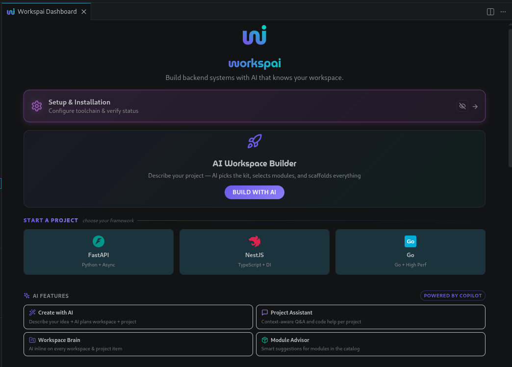
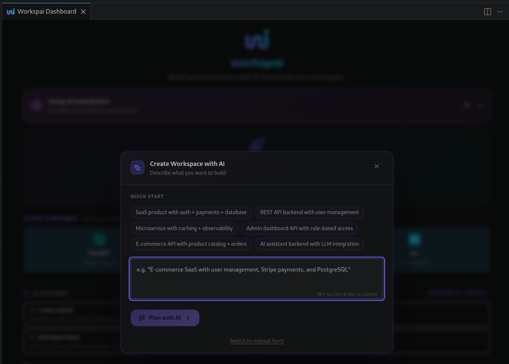
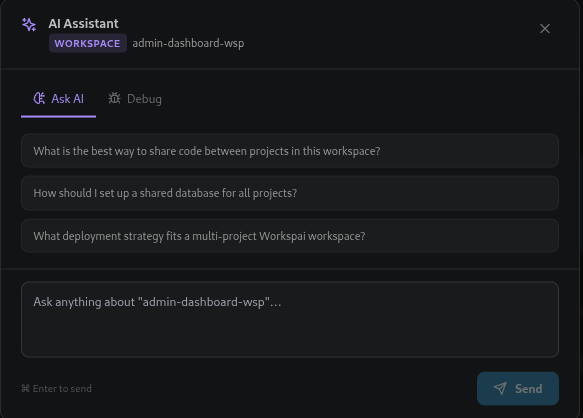
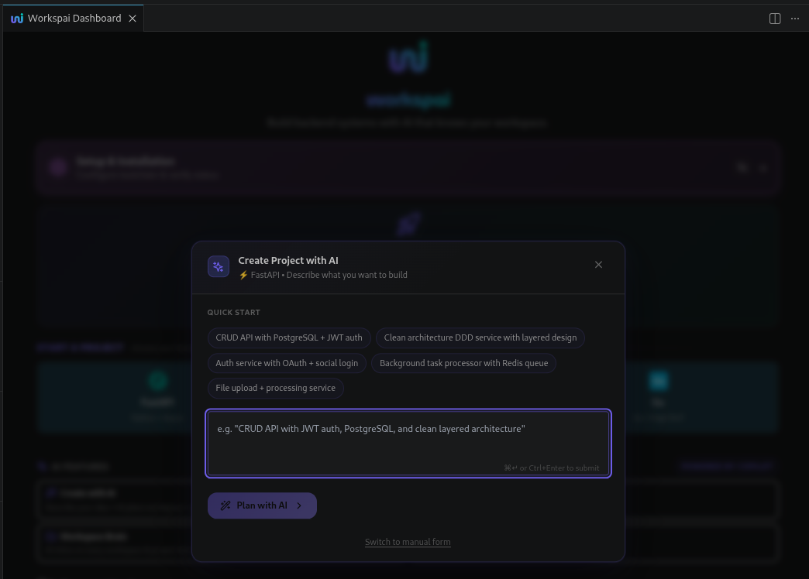
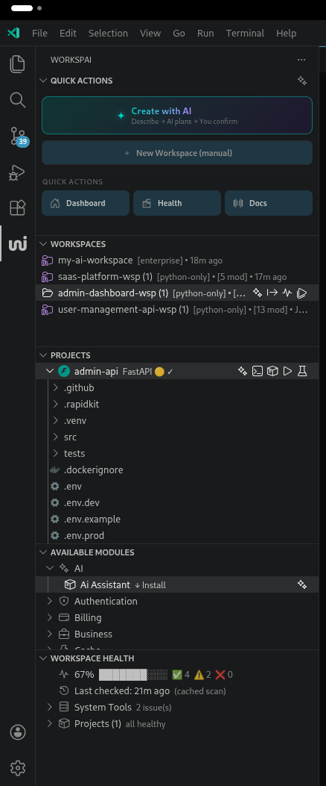
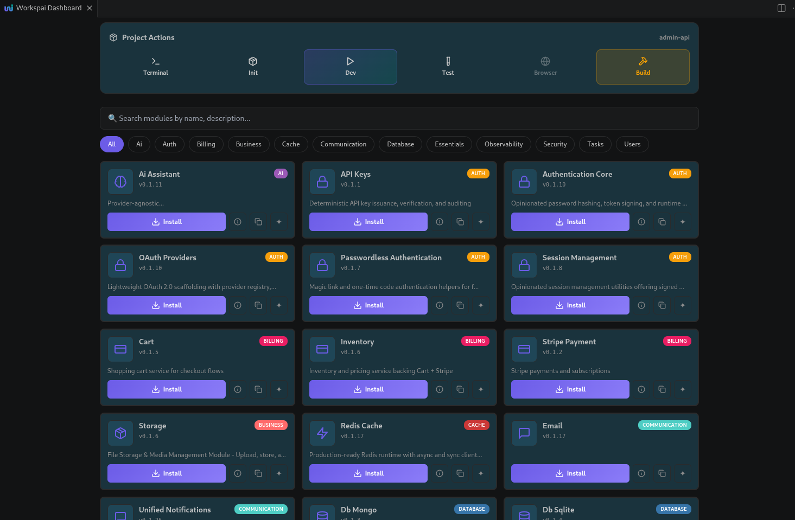
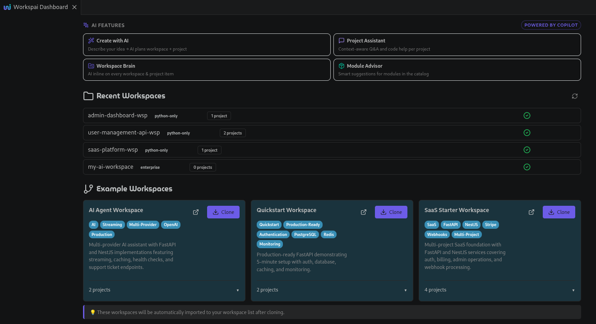
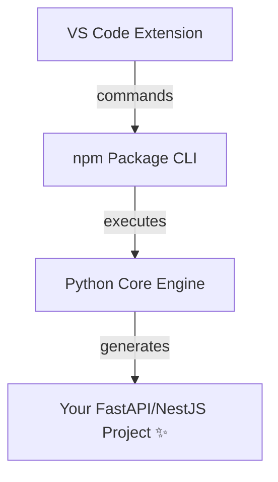

# Workspai for VS Code

<div align="center">

**The AI workspace for backend teams.**

Build backend systems with AI that knows your workspace.
Generate projects and modules from intent, debug with full context, and ship faster — all inside VS Code.
FastAPI · NestJS · Go/Fiber · Go/Gin · Clean architecture · 27+ free modules

[](https://marketplace.visualstudio.com/items?itemName=rapidkit.rapidkit-vscode)
[](https://marketplace.visualstudio.com/items?itemName=rapidkit.rapidkit-vscode)
[](https://www.npmjs.com/package/rapidkit)
[](https://getrapidkit.com)

[Install Extension](https://marketplace.visualstudio.com/items?itemName=rapidkit.rapidkit-vscode) · [Documentation](https://www.workspai.com/) · [Report Bug](https://github.com/getrapidkit/rapidkit-vscode/issues)

</div>

---

## Workspai in the RapidKit Ecosystem

Workspai is a product developed by RapidKit.

This VS Code extension is the IDE layer of Workspai and works alongside the official RapidKit tools below.

| Component | Repository | Role |
|---|---|---|
| VS Code Extension | [getrapidkit/rapidkit-vscode](https://github.com/getrapidkit/rapidkit-vscode) | Workspai extension UI |
| CLI | [getrapidkit/rapidkit-npm](https://github.com/getrapidkit/rapidkit-npm) | Official RapidKit npm CLI used by Workspai |
| Core Engine | [getrapidkit/rapidkit-core](https://github.com/getrapidkit/rapidkit-core) | Official RapidKit Core used for generation and automation |
| Examples | [getrapidkit/rapidkit-examples](https://github.com/getrapidkit/rapidkit-examples) | Example workspaces and starter references |

---

## Features in Action

### Dashboard — Your Central Hub


**Everything in one place:** The Workspai dashboard gives you instant access to AI workspace creation, framework quick-start cards (FastAPI, NestJS, Go), and an overview of all AI features — powered by GitHub Copilot.

### AI Workspace Builder — Describe, Plan, Confirm


**From intent to scaffold in seconds:** Click _Build with AI_, describe your product in plain language, pick from quick-start presets or type your own, and let AI plan the full workspace — profile, kit, and modules included.

### AI Assistant — Ask or Debug


**Context-aware AI inside VS Code:** The AI Assistant modal opens from any workspace, project, or module item. Switch between **Ask AI** (code Q&A grounded in your project structure) and **Debug** (paste logs and stack traces for root-cause analysis).

### Create Project with AI


**Framework-specific scaffolding:** When creating a project inside a workspace, AI pre-selects framework-appropriate presets (FastAPI, NestJS, Go) and scaffolds the full project with the correct kit and module set.

### Sidebar Explorer — Full Workspace Control


**One sidebar, everything:** Quick Actions with AI creation, workspace list with health indicators, project file tree, available module catalog, and the Workspace Health panel — all without leaving the sidebar.

### Module Browser — Browse, Filter, Install


**27+ production-ready modules:** Browse by category (Auth, Database, Cache, AI, Billing, Security, and more), search by name, and install directly from the dashboard. Each project's action bar (Terminal, Init, Dev, Test, Build) is always one click away.

### Recent Workspaces & Example Templates


**Pick up where you left off:** Recent workspaces are listed with profile and project count. Clone ready-made example workspaces (AI Agent, Quickstart, SaaS Starter) to get a production-grade backend running in minutes.

---

## ⚡ Quick Start

```
1. Ctrl+Shift+P → "Workspai: Create Workspace"
2. Open your workspace and run "Workspai: Run System Check"
3. Create project: FastAPI, NestJS, Go/Fiber, or Go/Gin
4. Done! 🎉
```

Your project is ready with:
- ✅ Full project structure
- ✅ Dependencies configured
- ✅ Dev server ready (`rapidkit dev`)
- ✅ API docs at `/docs`

---

## 🎯 What is Workspai?

Workspai (powered by RapidKit) generates **production-ready backend projects** with **clean architecture** built-in:

| Framework | Language | Features |
|-----------|----------|----------|
| **FastAPI** | Python | Async, auto-docs, type hints, Poetry |
| **NestJS** | TypeScript | Modular, decorators, DI, npm/yarn/pnpm |
| **Go/Fiber** | Go | High-performance HTTP, middleware, Swagger docs |
| **Go/Gin** | Go | Minimal HTTP framework, routing, Swagger docs |

**Plus 27+ production-ready modules:** Auth, Database, Cache, Logging, and more!

### 🧩 Available Modules

<details>
<summary><b>Click to see all 27 modules</b></summary>

| Category | Modules |
|----------|--------|
| 🔐 **Auth** | Authentication Core, API Keys, OAuth, Passwordless, Session Management |
| 💳 **Billing** | Cart, Inventory, Stripe Payment |
| 🗄️ **Database** | PostgreSQL, MongoDB, SQLite |
| 🔒 **Security** | CORS, Rate Limiting, Security Headers |
| 📧 **Communication** | Email, Unified Notifications |
| 👥 **Users** | Users Core, Users Profiles |
| ⚙️ **Essentials** | Settings, Middleware, Logging, Deployment |
| 📊 **Observability** | Observability Core |
| 💾 **Caching** | Redis Cache |
| 🤖 **AI** | AI Assistant |
| ⚡ **Tasks** | Celery |
| 💼 **Business** | Storage |

**Install via Extension:** Browse Modules sidebar • **Install via CLI:** `rapidkit add module <slug>`

</details>

---

## 📂 Project Structure

### Workspace Structure
```
my-workspace/                # Root workspace directory
├── .rapidkit-workspace      # Workspace marker
├── pyproject.toml           # Workspace Python config (stub; rapidkit-core declared)
├── poetry.toml              # Poetry config (virtualenvs.in-project = true)
├── poetry.lock              # Created on first `rapidkit init` (not go-only)
├── .venv/                   # Shared Python venv — created on first `rapidkit init` (not go-only)
├── rapidkit                 # CLI launcher (Unix) — created on first `rapidkit init`
├── rapidkit.cmd             # CLI launcher (Windows) — created on first `rapidkit init`
├── README.md                # Workspace documentation
└── my-api/                  # FastAPI project
    ├── .rapidkit/           # Project config (see below)
    ├── .venv/               # Project virtual environment
    ├── src/                 # Source code
    ├── config/              # Configuration
    ├── tests/               # Test suite
    ├── pyproject.toml       # Project dependencies
    └── README.md
```

> **`go-only` workspaces** never have `.venv/`, `poetry.lock`, or launcher scripts — Go kits run entirely through npm without a Python engine.

### FastAPI Project
```
my-api/
├── .rapidkit/               # RapidKit configuration
│   ├── project.json         # Project metadata
│   ├── context.json         # Project context & history
│   ├── file-hashes.json     # File integrity tracking
│   ├── cli.py               # Local CLI module
│   ├── activate             # Environment activation script
│   ├── rapidkit             # Project CLI wrapper
│   ├── snippet_registry.json # Code snippet tracking
│   ├── audit/               # Audit logs
│   │   └── snippet_injections.jsonl
│   ├── snapshots/           # File snapshots (rollback)
│   └── vendor/              # Vendored modules
│       ├── deployment/
│       ├── logging/
│       ├── middleware/
│       └── settings/
├── .venv/                   # Python virtual environment
├── src/                     # Source code
│   ├── main.py              # FastAPI entry point
│   ├── routing/             # API routes
│   │   └── health.py
│   └── modules/             # Feature modules
├── config/                  # Configuration
├── tests/                   # Test suite
├── .env.example             # Environment template
├── .python-version          # Python version lock
├── bootstrap.sh             # Setup script
├── docker-compose.yml       # Docker Compose
├── Dockerfile               # Docker config
├── Makefile                 # Make commands
├── poetry.lock              # Locked dependencies
├── pyproject.toml           # Poetry config
└── README.md
```

### NestJS Project
```
my-app/
├── .rapidkit/               # RapidKit configuration
│   ├── project.json         # Project metadata
│   ├── context.json         # Project context & history
│   ├── file-hashes.json     # File integrity tracking
│   ├── cli.js               # Local CLI module (optional)
│   ├── activate             # Environment activation script
│   ├── rapidkit             # Project CLI wrapper
│   ├── snippet_registry.json # Code snippet tracking
│   ├── audit/               # Audit logs
│   ├── snapshots/           # File snapshots (rollback)
│   └── vendor/              # Vendored modules
├── node_modules/            # Node.js dependencies
├── src/                     # Source code
│   ├── main.ts              # NestJS entry point
│   ├── app.module.ts        # Root module
│   ├── app.controller.ts    # Root controller
│   ├── app.service.ts       # Root service
│   ├── config/              # Configuration module
│   ├── examples/            # Example CRUD module
│   └── modules/             # Feature modules
├── test/                    # Test suite
├── .env.example             # Environment template
├── .node-version            # Node version lock
├── .nvmrc                   # NVM version file
├── bootstrap.sh             # Setup script
├── docker-compose.yml       # Docker Compose
├── Dockerfile               # Docker config
├── eslint.config.cjs        # ESLint config
├── jest.config.ts           # Jest config
├── nest-cli.json            # NestJS CLI config
├── package.json             # npm dependencies
├── yarn.lock / package-lock.json
├── tsconfig.json            # TypeScript config
└── README.md
```

---

## 🛠️ Project Commands

After creating a project, use these commands:

```bash
cd my-api
npx rapidkit init      # Install dependencies
npx rapidkit dev       # Start dev server (port 8000)
npx rapidkit test      # Run tests
npx rapidkit build     # Build for production
npx rapidkit lint      # Lint code
npx rapidkit format    # Format code
```

> **Note:** `npx rapidkit` auto-detects when you're inside a project. Or install globally: `npm i -g rapidkit`

---

## 🎨 Extension Features

### Commands (Ctrl+Shift+P)

| Command | Description |
|---------|-------------|
| `Workspai: Create Workspace` | Create a new workspace (interactive profile picker) |
| `Workspai: Create Project` | Generate a FastAPI, NestJS, Go/Fiber, or Go/Gin project |
| `Workspai: Create FastAPI Project` | Quick FastAPI project creation |
| `Workspai: Create NestJS Project` | Quick NestJS project creation |
| `Workspai: Run System Check` | Check system requirements |
| `Workspai: Check Workspai Installation` | Verify extension prerequisites and setup |
| `Workspai: Open Documentation` | Open Workspai documentation |
| `Workspai: Open Setup & Installation` | Open guided setup for RapidKit CLI and RapidKit Core |
| `Workspai: AI Assistant` | Open AI Assistant — ask questions or debug with AI |

### Keyboard Shortcuts

| Shortcut | Action |
|----------|--------|
| `Ctrl+Shift+R Ctrl+Shift+W` | Create Workspace |
| `Ctrl+Shift+R Ctrl+Shift+P` | Create Project |

### Sidebar

- **Quick Actions** - One-click buttons for creating workspaces, projects, and opening AI Assistant
- **Workspaces View** - Manage all your Workspai workspaces
    - Right-click a workspace for: Bootstrap, Setup, Cache/Mirror ops, and Policy actions
    - Policy actions map directly to npm CLI:
        - `npx rapidkit workspace policy show`
        - `npx rapidkit workspace policy set <key> <value>`
- **Projects View** - Browse projects in current workspace
- **Modules View** - Explore and install modules
- **Health View** - System diagnostics with AI-powered fix suggestions

---

## 📋 Requirements

| Tool | Version | Required For |
|------|---------|--------------|
| VS Code | 1.100+ | Extension |
| Node.js | 18+ | CLI & NestJS |
| Python | 3.10+ | FastAPI, ML & RapidKit Core |
| Poetry | Latest | FastAPI dependencies (auto-installed) |
| Go | 1.21+ | Go/Fiber & Go/Gin projects |
| Git | Latest | Version control |

**Check requirements:** Run `Workspai: Run System Check` from Command Palette.

---

## 🌐 Workspai Ecosystem

Workspai consists of three integrated components that work together with clear responsibilities:

### 1️⃣ VS Code Extension (This Extension)

[](https://marketplace.visualstudio.com/items?itemName=rapidkit.rapidkit-vscode) [](https://marketplace.visualstudio.com/items?itemName=rapidkit.rapidkit-vscode)

**Installation:**
```bash
# VS Code Marketplace
code --install-extension rapidkit.rapidkit-vscode
```

**Features:**
- 🎨 Visual workspace management
- 🚀 One-click project creation
- 🤖 AI Assistant for debugging and workspace questions
- 🩺 System diagnostics with Doctor Fix AI
- 📂 Sidebar navigation
- ⌨️ Command palette integration

[📦 Install from Marketplace](https://marketplace.visualstudio.com/items?itemName=rapidkit.rapidkit-vscode)

---

### 2️⃣ RapidKit npm Package (CLI Bridge)

[](https://www.npmjs.com/package/rapidkit) [](https://www.npmjs.com/package/rapidkit)

**Installation:**
```bash
# Use directly (no install needed)
npx rapidkit my-workspace

# Or install globally
npm install -g rapidkit
```

**Features:**
- 🔧 Full CLI for workspace & project management
- 🐍 Bridges TypeScript to Python Core
- 📦 Manages Poetry/venv automatically
- 📋 Shared workspace registry

**Quick Commands:**
```bash
npx rapidkit create                       # Interactive mode
npx rapidkit workspace list               # List all workspaces
npx rapidkit workspace policy show        # Show workspace policy
npx rapidkit workspace policy set <key> <value> # Set workspace policy key
npx rapidkit add module auth              # Add modules to project
```

[📦 View on npm](https://www.npmjs.com/package/rapidkit) • [💻 GitHub Repo](https://github.com/getrapidkit/rapidkit-npm)

---

### 3️⃣ RapidKit Core (Generation Engine)

[](https://pypi.org/project/rapidkit-core/) [](https://pypi.org/project/rapidkit-core/)

**Installation:**
```bash
# Auto-installed by Extension & npm package
# Or install manually:
pip install rapidkit-core
```

**Features:**
- 🏗️ Core code generation engine
- 📚 27+ production-ready modules
- 🎯 FastAPI & NestJS templates
- 🔄 Module registry & dependency management

**Provides:**
- Auth, Database, Cache, Redis
- Logging, Monitoring, Testing
- API clients, WebSockets, Storage
- Deployment, Security, and more...

[🐍 View on PyPI](https://pypi.org/project/rapidkit-core/)

---

### 🔗 How They Work Together


```mermaid
graph TD
    A[VS Code Extension] -->|commands| B[npm Package CLI]
    B -->|executes| C[Python Core Engine]
    C -->|generates| D[Your FastAPI/NestJS Project ✨]
```

**Integration Flow:**
1. **Extension** provides beautiful UI and VS Code integration
2. **npm Package** bridges TypeScript and Python ecosystems  
3. **Python Core** handles all code generation and scaffolding
4. **Result** is a production-ready project with clean architecture

---

### 🔄 Cross-Tool Workspace Compatibility

All workspaces are **fully compatible** across tools:

| Feature | Description |
|---------|-------------|
| **Shared Registry** | `~/.rapidkit/workspaces.json` stores all workspaces |
| **Unified Signature** | Both tools use `RAPIDKIT_WORKSPACE` marker |
| **Auto-Detection** | Works from any subdirectory in either tool |
| **Module Management** | Add via Extension UI or `rapidkit add module` |

**Example Workflow:**
```bash
# 1. Create workspace via npm
npx rapidkit my-workspace

# 2. Open in VS Code (auto-detected)
code my-workspace

# 3. Create project via Extension UI (Ctrl+Shift+P → Workspai: Create Project)

# 4. Add modules via CLI
cd my-project
rapidkit add module auth
rapidkit add module redis

# 5. View all workspaces
rapidkit workspace list
```

---

## 🔧 Troubleshooting

### Extension not showing commands?
- Reload VS Code: `Ctrl+Shift+P` → `Developer: Reload Window`
- Check VS Code version: 1.100+ required

### Python not found?
- Run `Workspai: Run System Check` to check requirements
- Install Python 3.10+ from [python.org](https://python.org)
- Restart VS Code after Python installation

### Project not creating?
- Ensure Node.js 18+ and Python 3.10+ are installed
- Check `Output` panel (View → Output → Workspai)
- Report issue with logs at [GitHub Issues](https://github.com/getrapidkit/rapidkit-vscode/issues)

### Workspace not detected?
- Ensure `.rapidkit-workspace` marker exists
- Run `rapidkit workspace sync` from terminal
- Check `~/.rapidkit/workspaces.json` registry

### Release gate override (emergency only)

Wave 1 release gate supports a controlled emergency override path. Use this only for exceptional cases.

```bash
npm run release:stop-gate -- \
    --marker <path-to-.rapidkit-workspace> \
    --allow-override \
    --override-owner <name-or-team> \
    --override-ticket <incident-or-jira-id> \
    --override-reason "short but concrete rationale"
```

Override events are logged to `.rapidkit/reports/release-gate-overrides.jsonl` (or `WORKSPAI_GATE_OVERRIDE_LOG`).

---

## 🔗 Links

- 📖 **Documentation:** [www.workspai.com](https://www.workspai.com/)
- 🧩 **Modules:** [27+ production-ready modules](https://getrapidkit.com/modules)
- 🐛 **Issues:** [GitHub Issues](https://github.com/getrapidkit/rapidkit-vscode/issues)
- 💬 **Community:** [Discord Server](https://discord.gg/rapidkit)
- 📝 **Changelog:** [CHANGELOG.md](CHANGELOG.md)

---

## 📄 License

MIT © [RapidKit](https://getrapidkit.com)
