# RapidKit for VS Code

<div align="center">

**Build production-ready APIs at warp speed**

FastAPI & NestJS scaffolding with clean architecture, 27+ free modules, and automation-first workflows

[](https://marketplace.visualstudio.com/items?itemName=rapidkit.rapidkit-vscode)
[](https://marketplace.visualstudio.com/items?itemName=rapidkit.rapidkit-vscode)
[](https://www.npmjs.com/package/rapidkit)

[Install Extension](https://marketplace.visualstudio.com/items?itemName=rapidkit.rapidkit-vscode) · [Documentation](https://www.getrapidkit.com/docs) · [Report Bug](https://github.com/getrapidkit/rapidkit-vscode/issues)

</div>

---

## Features in Action

### Welcome Page - Your Central Hub


**Your first stop:** Quick access to workspaces, module browser, and setup verification. Browse recent projects, check workspace health with one click, and explore 27+ available modules - all from your central hub.

### Setup Status - Toolchain Verification


**Get ready fast:** Dedicated setup panel for verifying your development toolchain. Check Python, pipx, Poetry, RapidKit CLI, and Core installation status at a glance. Color-coded status indicators and one-click installation buttons guide you through the setup.

### Module Browser - Pick Your Stack


**Choose what you need:** Browse 27+ production-ready modules organized by category (Auth, Database, Cache, AI, and more). See installation status, version info, and install directly from the extension with dependency management included.

### 🩺 New: Workspace Health Check
Check the health of any workspace with one click! The pulse icon (🩺) next to each workspace in the sidebar runs comprehensive diagnostics:
- ✅ Python version check
- ✅ Package managers (pip, pipx, Poetry)
- ✅ RapidKit Core installation
- ✅ Workspace configuration integrity

---

## ⚡ Quick Start

```
1. Ctrl+Shift+P → "RapidKit: Create Project"
2. Choose: FastAPI or NestJS
3. Enter project name
4. Done! 🎉
```

Your project is ready with:
- ✅ Full project structure
- ✅ Dependencies configured
- ✅ Dev server ready (`rapidkit dev`)
- ✅ API docs at `/docs`

---

## 🎯 What is RapidKit?

RapidKit generates **production-ready backend projects** with **clean architecture** built-in:

| Framework | Language | Features |
|-----------|----------|----------|
| **FastAPI** | Python | Async, auto-docs, type hints, Poetry |
| **NestJS** | TypeScript | Modular, decorators, DI, npm/yarn/pnpm |

**Plus 27+ production-ready modules:** Auth, Database, Cache, Logging, and more!

### 🧩 Available Modules

<details>
<summary><b>Click to see all 27 modules</b></summary>

| Category | Modules |
|----------|--------|
| 🔐 **Auth** | Authentication Core, API Keys, OAuth, Passwordless, Session Management |
| 💳 **Billing** | Cart, Inventory, Stripe Payment |
| 🗄️ **Database** | PostgreSQL, MongoDB, SQLite |
| 🔒 **Security** | CORS, Rate Limiting, Security Headers |
| 📧 **Communication** | Email, Unified Notifications |
| 👥 **Users** | Users Core, Users Profiles |
| ⚙️ **Essentials** | Settings, Middleware, Logging, Deployment |
| 📊 **Observability** | Observability Core |
| 💾 **Caching** | Redis Cache |
| 🤖 **AI** | AI Assistant |
| ⚡ **Tasks** | Celery |
| 💼 **Business** | Storage |

**Install via Extension:** Browse Modules sidebar • **Install via CLI:** `rapidkit add module <slug>`

</details>

---

## 📂 Project Structure

### Workspace Structure
```
my-workspace/                # Root workspace directory
├── .rapidkit-workspace      # Workspace marker
├── .venv/                   # Shared Python virtual environment
├── .python-version          # Python version (e.g., 3.11.1)
├── poetry.toml              # Poetry configuration
├── pyproject.toml           # Workspace dependencies
├── poetry.lock              # Locked dependencies
├── rapidkit                 # CLI wrapper (Unix)
├── rapidkit.cmd             # CLI wrapper (Windows)
├── README.md                # Workspace documentation
└── my-api/                  # FastAPI project
    ├── .rapidkit/           # Project config (see below)
    ├── .venv/               # Project virtual environment
    ├── src/                 # Source code
    ├── config/              # Configuration
    ├── tests/               # Test suite
    ├── pyproject.toml       # Project dependencies
    └── README.md
```

### FastAPI Project
```
my-api/
├── .rapidkit/               # RapidKit configuration
│   ├── project.json         # Project metadata
│   ├── context.json         # Project context & history
│   ├── file-hashes.json     # File integrity tracking
│   ├── cli.py               # Local CLI module
│   ├── activate             # Environment activation script
│   ├── rapidkit             # Project CLI wrapper
│   ├── snippet_registry.json # Code snippet tracking
│   ├── audit/               # Audit logs
│   │   └── snippet_injections.jsonl
│   ├── snapshots/           # File snapshots (rollback)
│   └── vendor/              # Vendored modules
│       ├── deployment/
│       ├── logging/
│       ├── middleware/
│       └── settings/
├── .venv/                   # Python virtual environment
├── src/                     # Source code
│   ├── main.py              # FastAPI entry point
│   ├── routing/             # API routes
│   │   └── health.py
│   └── modules/             # Feature modules
├── config/                  # Configuration
├── tests/                   # Test suite
├── .env.example             # Environment template
├── .python-version          # Python version lock
├── bootstrap.sh             # Setup script
├── docker-compose.yml       # Docker Compose
├── Dockerfile               # Docker config
├── Makefile                 # Make commands
├── poetry.lock              # Locked dependencies
├── pyproject.toml           # Poetry config
└── README.md
```

### NestJS Project
```
my-app/
├── .rapidkit/               # RapidKit configuration
│   ├── project.json         # Project metadata
│   ├── context.json         # Project context & history
│   ├── file-hashes.json     # File integrity tracking
│   ├── cli.js               # Local CLI module (optional)
│   ├── activate             # Environment activation script
│   ├── rapidkit             # Project CLI wrapper
│   ├── snippet_registry.json # Code snippet tracking
│   ├── audit/               # Audit logs
│   ├── snapshots/           # File snapshots (rollback)
│   └── vendor/              # Vendored modules
├── node_modules/            # Node.js dependencies
├── src/                     # Source code
│   ├── main.ts              # NestJS entry point
│   ├── app.module.ts        # Root module
│   ├── app.controller.ts    # Root controller
│   ├── app.service.ts       # Root service
│   ├── config/              # Configuration module
│   ├── examples/            # Example CRUD module
│   └── modules/             # Feature modules
├── test/                    # Test suite
├── .env.example             # Environment template
├── .node-version            # Node version lock
├── .nvmrc                   # NVM version file
├── bootstrap.sh             # Setup script
├── docker-compose.yml       # Docker Compose
├── Dockerfile               # Docker config
├── eslint.config.cjs        # ESLint config
├── jest.config.ts           # Jest config
├── nest-cli.json            # NestJS CLI config
├── package.json             # npm dependencies
├── yarn.lock / package-lock.json
├── tsconfig.json            # TypeScript config
└── README.md
```

---

## 🛠️ Project Commands

After creating a project, use these commands:

```bash
cd my-api
npx rapidkit init      # Install dependencies
npx rapidkit dev       # Start dev server (port 8000)
npx rapidkit test      # Run tests
npx rapidkit build     # Build for production
npx rapidkit lint      # Lint code
npx rapidkit format    # Format code
```

> **Note:** `npx rapidkit` auto-detects when you're inside a project. Or install globally: `npm i -g rapidkit`

---

## 🎨 Extension Features

### Commands (Ctrl+Shift+P)

| Command | Description |
|---------|-------------|
| `RapidKit: Create Workspace` | Create a new workspace for multiple projects |
| `RapidKit: Create Project` | Generate a FastAPI or NestJS project |
| `RapidKit: Create FastAPI Project` | Quick FastAPI project creation |
| `RapidKit: Create NestJS Project` | Quick NestJS project creation |
| `RapidKit: System Doctor` | Check system requirements |
| `RapidKit: Open Documentation` | Open RapidKit docs |

### Keyboard Shortcuts

| Shortcut | Action |
|----------|--------|
| `Ctrl+Shift+R Ctrl+Shift+W` | Create Workspace |
| `Ctrl+Shift+R Ctrl+Shift+P` | Create Project |

### Sidebar

- **Workspaces View** - Manage all your RapidKit workspaces
- **Projects View** - Browse projects in current workspace
- **Modules View** - Explore and install modules

---

## 📋 Requirements

| Tool | Version | Required For |
|------|---------|--------------|
| VS Code | 1.100+ | Extension |
| Node.js | 18+ | CLI & NestJS |
| Python | 3.10+ | FastAPI & RapidKit Core |
| Poetry | Latest | FastAPI dependencies (auto-installed) |
| Git | Latest | Version control |

**Check requirements:** Run `RapidKit: System Doctor` from Command Palette.

---

## 🌐 RapidKit Ecosystem

RapidKit consists of three integrated components that work seamlessly together:

### 1️⃣ VS Code Extension (This Extension)

[](https://marketplace.visualstudio.com/items?itemName=rapidkit.rapidkit-vscode) [](https://marketplace.visualstudio.com/items?itemName=rapidkit.rapidkit-vscode)

**Installation:**
```bash
# VS Code Marketplace
code --install-extension rapidkit.rapidkit-vscode
```

**Features:**
- 🎨 Visual workspace management
- 🚀 One-click project creation
- 📂 Sidebar navigation
- 🩺 System diagnostics
- ⌨️ Command palette integration

[📦 Install from Marketplace](https://marketplace.visualstudio.com/items?itemName=rapidkit.rapidkit-vscode)

---

### 2️⃣ npm Package (CLI Bridge)

[](https://www.npmjs.com/package/rapidkit) [](https://www.npmjs.com/package/rapidkit)

**Installation:**
```bash
# Use directly (no install needed)
npx rapidkit my-workspace

# Or install globally
npm install -g rapidkit
```

**Features:**
- 🔧 Full CLI for workspace & project management
- 🐍 Bridges TypeScript to Python Core
- 📦 Manages Poetry/venv automatically
- 📋 Shared workspace registry

**Quick Commands:**
```bash
rapidkit create          # Interactive mode
rapidkit workspace list  # List all workspaces
rapidkit add module auth # Add modules to project
```

[📦 View on npm](https://www.npmjs.com/package/rapidkit) • [💻 GitHub Repo](https://github.com/getrapidkit/rapidkit-npm)

---

### 3️⃣ Python Core (Generation Engine)

[](https://pypi.org/project/rapidkit-core/) [](https://pypi.org/project/rapidkit-core/)

**Installation:**
```bash
# Auto-installed by Extension & npm package
# Or install manually:
pip install rapidkit-core
```

**Features:**
- 🏗️ Core code generation engine
- 📚 27+ production-ready modules
- 🎯 FastAPI & NestJS templates
- 🔄 Module registry & dependency management

**Provides:**
- Auth, Database, Cache, Redis
- Logging, Monitoring, Testing
- API clients, WebSockets, Storage
- Deployment, Security, and more...

[🐍 View on PyPI](https://pypi.org/project/rapidkit-core/)

---

### 🔗 How They Work Together

```mermaid
graph TD
    A[VS Code Extension] -->|commands| B[npm Package CLI]
    B -->|executes| C[Python Core Engine]
    C -->|generates| D[Your FastAPI/NestJS Project ✨]
```



**Integration Flow:**
1. **Extension** provides beautiful UI and VS Code integration
2. **npm Package** bridges TypeScript and Python ecosystems  
3. **Python Core** handles all code generation and scaffolding
4. **Result** is a production-ready project with clean architecture

---

### 🔄 Cross-Tool Workspace Compatibility

All workspaces are **fully compatible** across tools:

| Feature | Description |
|---------|-------------|
| **Shared Registry** | `~/.rapidkit/workspaces.json` stores all workspaces |
| **Unified Signature** | Both tools use `RAPIDKIT_WORKSPACE` marker |
| **Auto-Detection** | Works from any subdirectory in either tool |
| **Module Management** | Add via Extension UI or `rapidkit add module` |

**Example Workflow:**
```bash
# 1. Create workspace via npm
npx rapidkit my-workspace

# 2. Open in VS Code (auto-detected)
code my-workspace

# 3. Create project via Extension UI (Ctrl+Shift+P → RapidKit: Create Project)

# 4. Add modules via CLI
cd my-project
rapidkit add module auth
rapidkit add module redis

# 5. View all workspaces
rapidkit workspace list
```

---

## � Troubleshooting

### Extension not showing commands?
- Reload VS Code: `Ctrl+Shift+P` → `Developer: Reload Window`
- Check VS Code version: 1.100+ required

### Python not found?
- Run `RapidKit: System Doctor` to check requirements
- Install Python 3.10+ from [python.org](https://python.org)
- Restart VS Code after Python installation

### Project not creating?
- Ensure Node.js 18+ and Python 3.10+ are installed
- Check `Output` panel (View → Output → RapidKit)
- Report issue with logs at [GitHub Issues](https://github.com/getrapidkit/rapidkit-vscode/issues)

### Workspace not detected?
- Ensure `.rapidkit-workspace` marker exists
- Run `rapidkit workspace sync` from terminal
- Check `~/.rapidkit/workspaces.json` registry

---

## �🔗 Links

- 📖 **Documentation:** [www.getrapidkit.com/docs](https://www.getrapidkit.com/docs)
- 🧩 **Modules:** [27+ production-ready modules](https://www.getrapidkit.com/modules)
- 🐛 **Issues:** [GitHub Issues](https://github.com/getrapidkit/rapidkit-vscode/issues)
- 💬 **Community:** [Discord Server](https://discord.gg/rapidkit)
- 📝 **Changelog:** [CHANGELOG.md](CHANGELOG.md)

---

## 📄 License

MIT © [RapidKit](https://www.getrapidkit.com)
